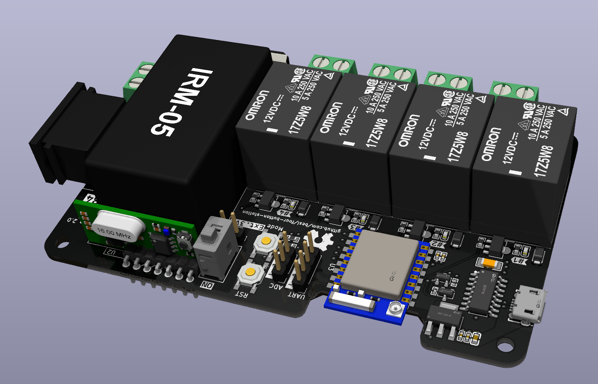

# Four button station

Control four Relays.

**WARNING**: This project uses 230V. Please be careful and use these resources at your own risk.

## Flashing

The used ESP-07 chip uses 1MB of flash so make sure to flash it with the [1MB flash image](https://micropython.org/download/ESP8266_GENERIC/).
